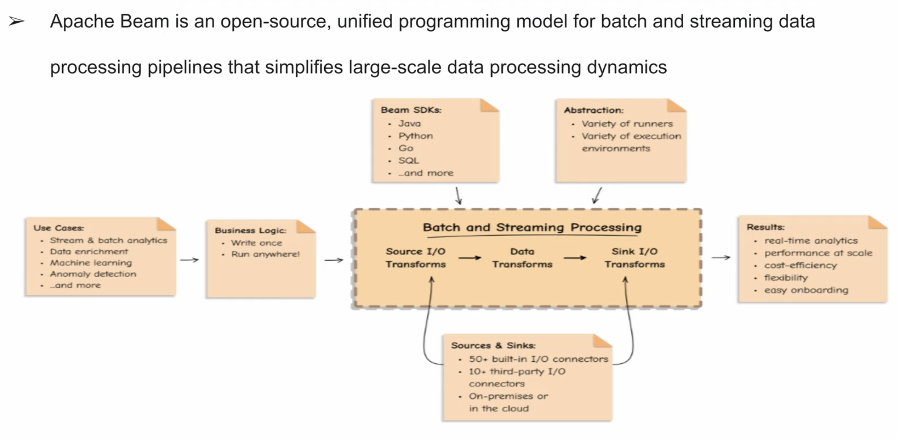
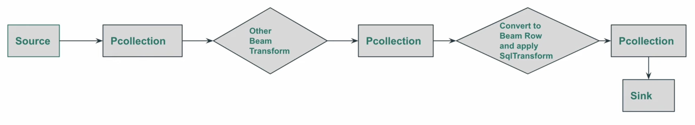

# Apache Beam

## Batch Data Processing

## Streaming Data Processing

## Apache Beam SQL

**Apache Beam SQL**
* Beam SQL allows a Beam user to query bounded and unbounded PCollections with SQL statements.
* Beam SAL supports the following dialects:
  * Beam Calcite SQL (default and for Big Data Processing)
  * Beam ZetaSQL (Big Query Compatiable)
* SqlTranform: The interface for creating PTranforms from SQL queries.
* Row: The type of elements that Beam SQL operates on. A PCollection<Row> plays the role of a table.

<!-- <ol>
    <li>This is</li>
    <li>a letter</li>
    <li>list</li>
</ol> -->

