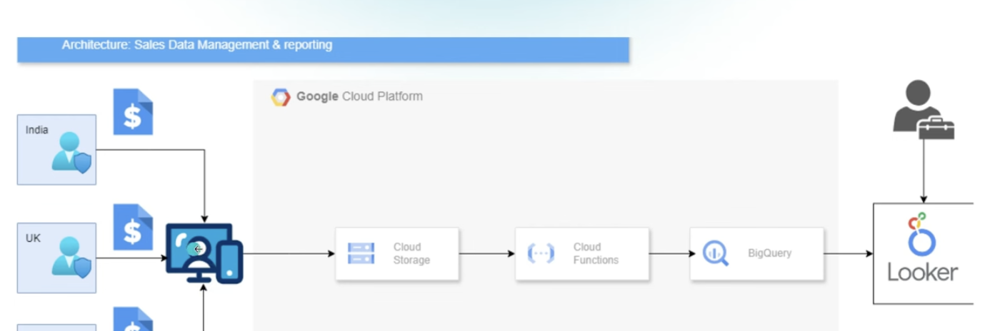

# Requirements

## Data Upload Portal:
* Design a web-based protal where shop managers can upload sales data files (eg CSV; Excel).
* Provide feedback on successful or failed uploads.

## Data Loading
* Store uploaded data in staging locations as raw data.
* Implement ETL processes to import data from the upload portal.
* Integrate with the data warehouse to load processed data.

## Summary Views and Reporting
* Develop summary views to show sales data by region (USA; UK; India) and globally.
* Implement dashboards for key metrics (eg total sales, sales by product, sales trends.)
* Allows for filtering and drill down capabilities (eg by data; region; product category.)

## Sample data
From Kaggle.
    E-Commerce Data
    